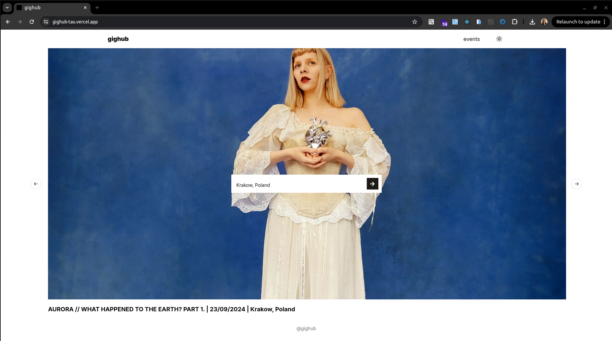
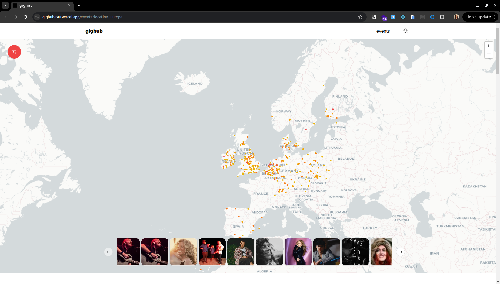
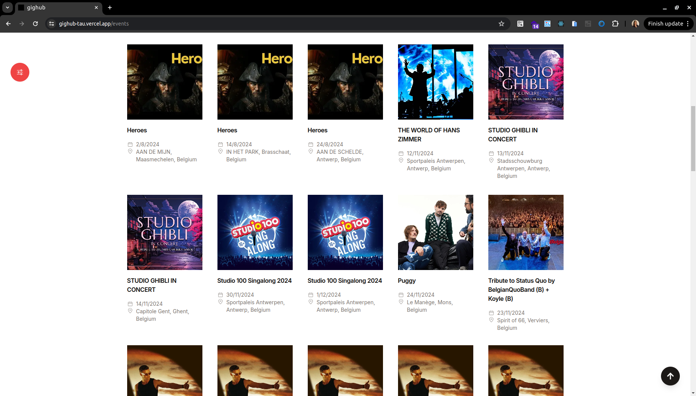
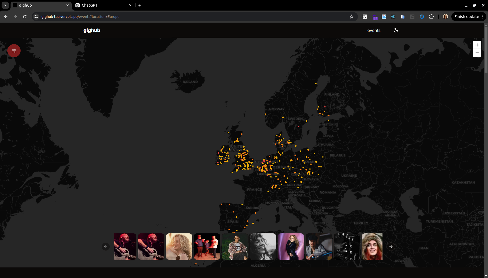
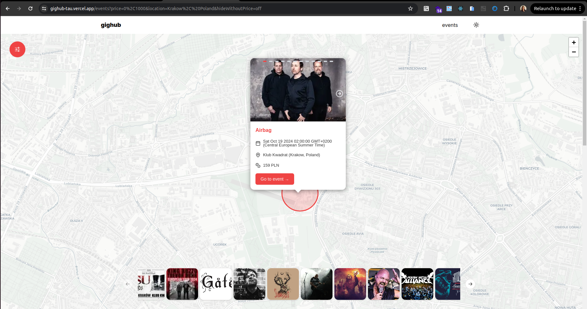
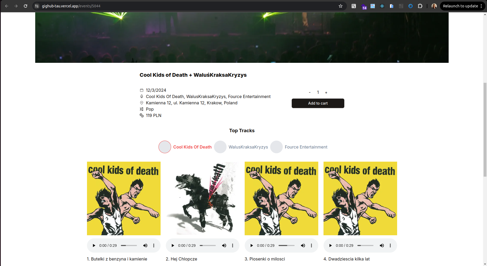
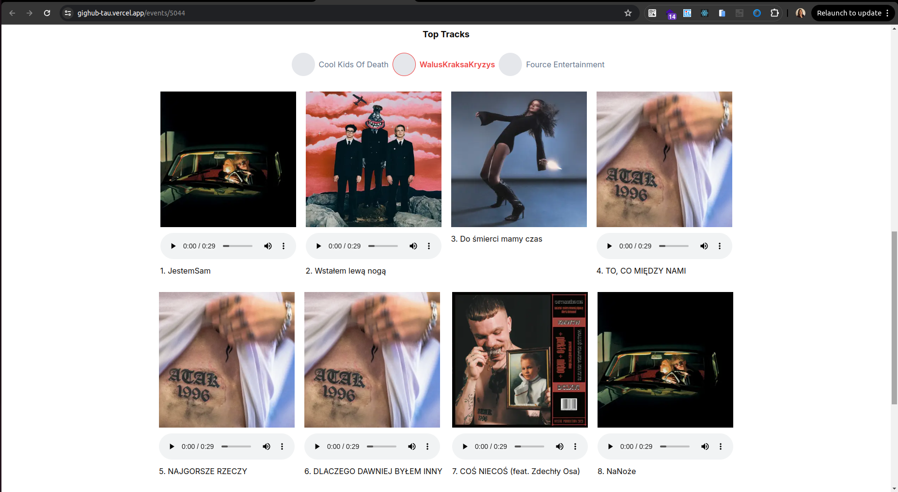
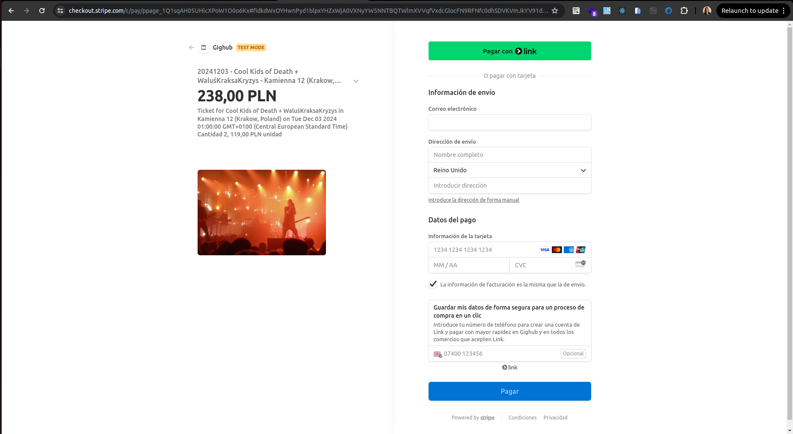
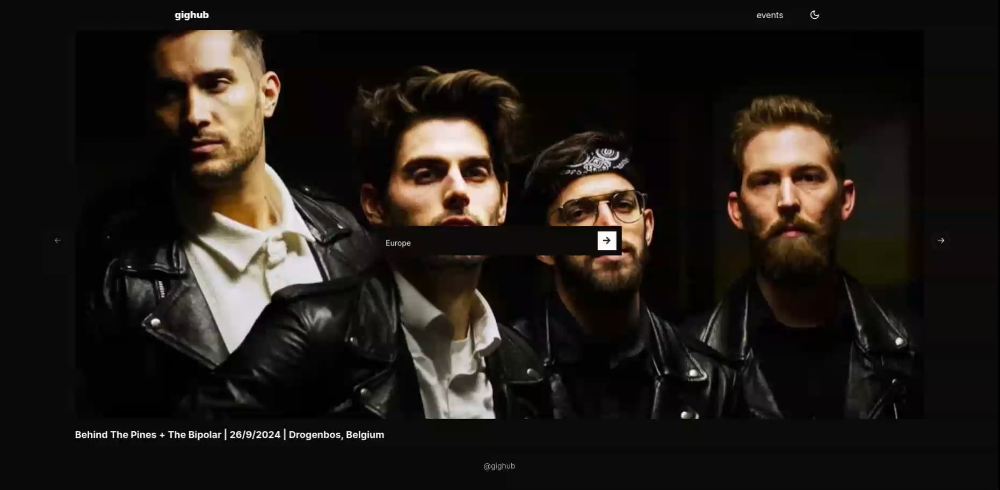
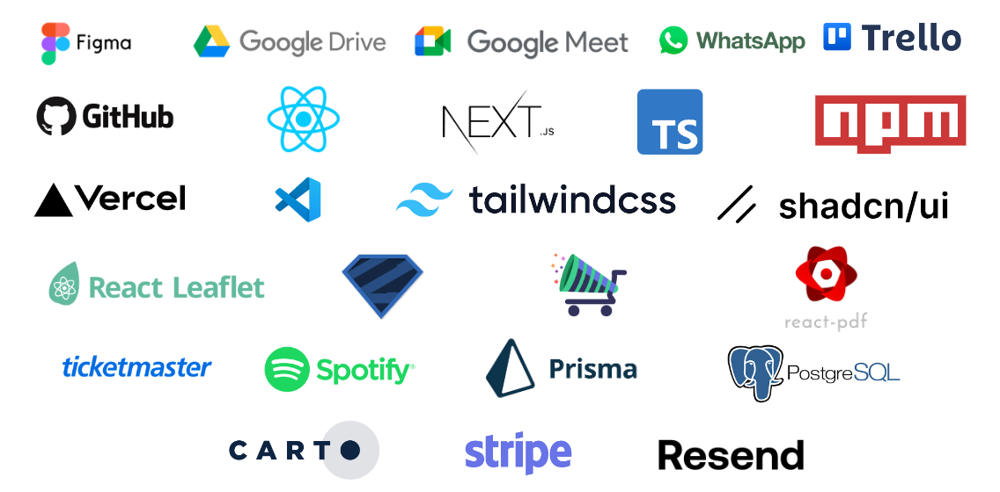

# Gighub

Final student project of the Postgraduate Course in Full-Stack Web Technologies at UPC School of Professional & Executive Development, consisting of an app that can be used to find music events and buy tickets across Europe.

<p align="center"> 
  
</p>

Its deployment can be found at [gighub-tau.vercel.app](https://gighub-tau.vercel.app/).

## Features

### Show all events in Europe

By default, we can see all events happening in Europe between August 1 and December 1, 2024.

<p align="center"> 
  
</p>

On the bottom of the map, a scrollable gallery will show a preview of the available events. If you prefer, you can visualise the events in a grid for quick information.

<p align="center"> 
  
</p>

### Dark mode

All pages can be visualised in dark mode. An example of this is the map.

<p align="center"> 
  
</p>

And grid below.

<p align="center"> 
  
</p>

### Find events by location

It is also possible to find events near your city. You can select your preferred location from the home page or within the filters tab on the top left.

<p align="center">
  
</p>

### Get events in a specific venue

If you zoom in a venue and click on the marker, you can get all events happening in a specific venue.

<p align="center"> 
  
</p>

### Filter by artist, genre, dates or price

You can make your search more precise by filtering by artist, genre, dates or price.

<p align="center"> 
  
</p>

### Get detailed information about an event

Once you found the event that you like, you can get detailed information about it.

<p align="center"> 
  
</p>

### Listen to the artists' top tracks

Listen to the top tracks of the artists that will be playing on that event.

<p align="center"> 
  
</p>

### Buy tickets

Finally, you can buy tickets to attend these events. Clicking on Proceed to checkout will lead you to the default Stripe payment gateway.

<p align="center"> 
  
</p>

## Demo video

<p align="center">
  <a href="https://vimeo.com/1012784684?share=copy#t=0">
    
  </a>
</p>

## Tech stack

<p align="center"> 
  
</p>

## Installation

To run this app locally, you will first need to clone the repository and install the dependencies:

```
git clone https://github.com/eduardogenari/gighub.git
npm install
```

To get access to the events and top tracks data you will first need to obtain the following credentials from Ticketmaster and Spotify: `APIKEY_TICKETMASTER`, `CLIENTID_SPOTIFY` and `CLIENTSECRET_SPOTIFY`.

If you want to create a database in Vercel as we did, you will also need to know your `POSTGRES_HOST`, `POSTGRES_PASSWORD`, `POSTGRES_PRISMA_URL`, `POSTGRES_URL`, `POSTGRES_URL_NON_POOLING`, `POSTGRES_URL_NO_SSL` and `POSTGRES_USER`.

To manage the payments and email notifications with the use of Stripe and Resend, you should also have `NEXT_PUBLIC_STRIPE_PUBLISHABLE_KEY`, `STRIPE_SECRET_KEY`, `STRIPE_WEBHOOK_SECRET` and `RESEND_API_KEY`.

Some environment variables are generic:

```
URL_TICKETMASTER="https://app.ticketmaster.com/discovery/v2/"
POSTGRES_DATABASE="verceldb"
NEXT_PUBLIC_EUROPE_COUNTRIES="AD,AT,AZ,BE,BG,HR,CY,CZ,DK,EE,FO,FI,FR,GE,DE,GI,GB,GR,HU,IS,IE,IT,LV,LT,LU,MT,MC,ME,NL,NO,PL,PT,RO,RU,RS,SK,SI,ES,SE,CH,UA"
NEXT_PUBLIC_SUCCESS_URL="http://localhost:3000/confirmation?session_id={CHECKOUT_SESSION_ID}"
NEXT_PUBLIC_CANCEL_URL="http://localhost:3000"
RESEND_URL="http://localhost:3000"
```

All these variables need to be stored in a .env file.

Once your app is connected to all the platforms, you can load your database by doing:

```
npx prisma generate
npx prisma db push
npx prisma db seed
```

The seed script can be found in the prisma folder and will load the events from Ticketmaster into your database, generate a table with all the locations and their bounding boxes and create the event products in Stripe. To check that everything has been loaded, you can access prisma studio:

```
npx prisma studio
```

After completing all these steps, you can run the app:

```
npm run dev
```

## Authors

<table  cellspacing="0" cellpadding="0" style="background-color:rgba(0, 0, 0, 0);">
  <tr>
    <td valign="top"></td>
    <td valign="top"><b>Laia Valentí Zurriaga</b><br>
      GitHub: <a href="https://github.com/TanitVZ">@TanitVZ</a> <br>
      ICT Technician at <a href="https://www.santboi.cat/"> Sant Boi Town Hall</a></td>
  </tr>
  <tr>
    <td valign="top"></td>
    <td valign="top"><b>Eduardo Mantovani Genari</b><br>
      GitHub: <a href="https://github.com/eduardogenari">@eduardogenari</a> <br>
      LinkedIn: <a href="https://www.linkedin.com/in/eduardogenari/">@eduardogenari</a> <br>
      Full-Stack Developer at <a href="https://www.ithinkupc.com/"> IThinkUPC </a></td>
  </tr>
  <tr>
    <td valign="top">
      
    </td>
    <td valign="top">      
      <b>Alba Vilanova Cortezón</b><br>
      GitHub: <a href="https://github.com/albavilanova">@albavilanova</a> <br>
      LinkedIn: <a href="https://www.linkedin.com/in/albavilanova/">@albavilanova</a> <br>
      Research Engineer and Web Developer at <a href="https://bsc.es/"> Barcelona Supercomputing Center</a>
    </td>
  </tr>
</table>